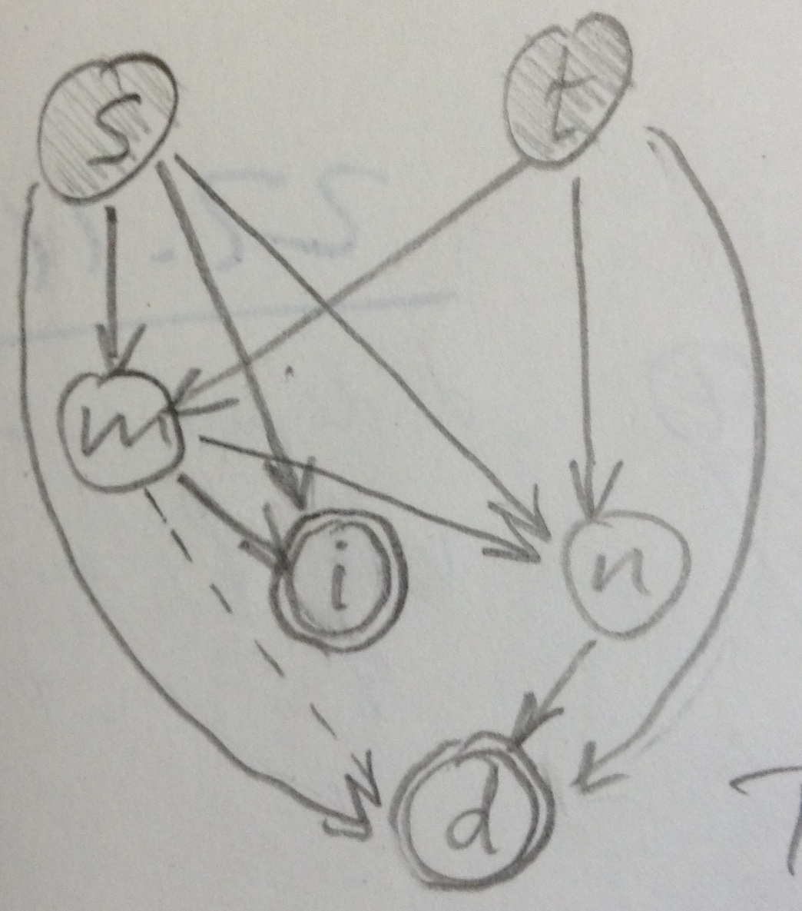
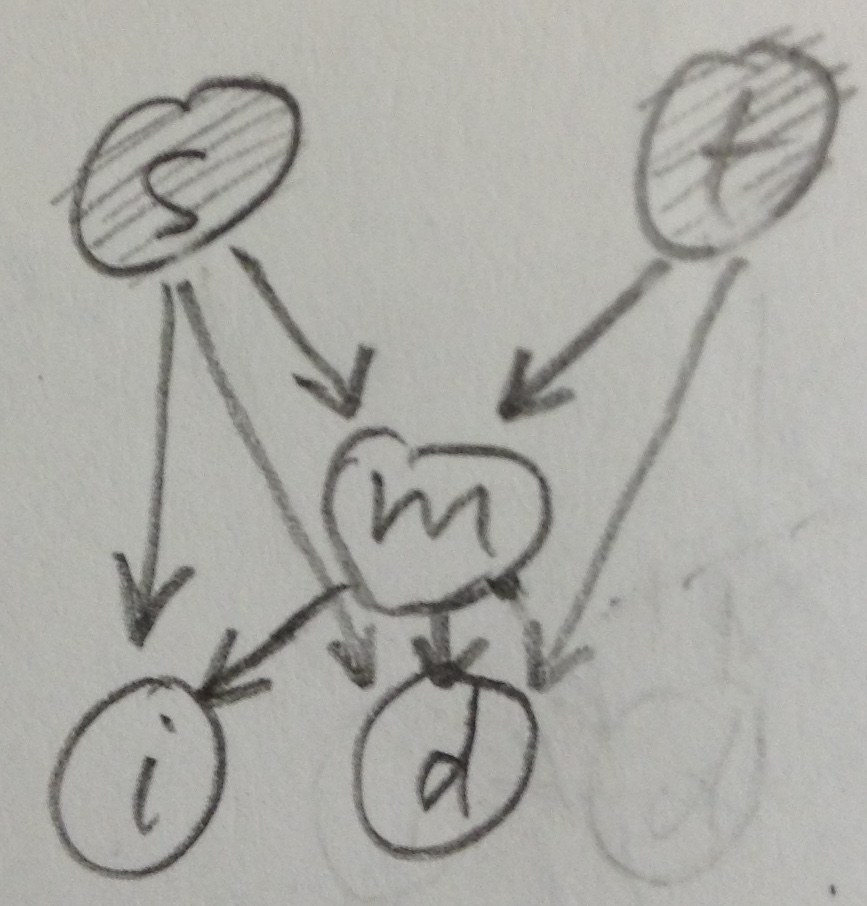

```{r prologue, include=FALSE, message=FALSE}
############### related work: http://www.mathcs.emory.edu/~lxiong/research/pub/gardner09automatic.pdf

library(lattice)

.default_par <- par(no.readonly=TRUE)

DATADIR <- sprintf('%s/wikimedia/trunk/data/anchor_placement', Sys.getenv('HOME'))
MIN_NUM_PATHS_PER_PAIR <- 5

split_at <- function(str, sep) strsplit(str, sep)[[1]]
```

# Research question

In our WSDM'16 paper we show how to use navigation traces to find important missing links.
We do not discuss, however, how to decide where in the source page to insert those links.

When the source contains appropriate anchor texts for the new link, these anchor texts become the candidate positions for the new link; all that remains to do is to ask a human which anchor text is best-suited.

Things become more interesting when the source contains no anchor text for the new link; here it is far less clear where to insert the link.
In essence, we have found a topic that is not yet, but should be, mentioned in the source, and the task is not simply to decide which existing anchor text to use, but rather where in the page to insert a new anchor text.

Here I explore whether it is feasible to use navigation traces for this purpose.

Consider an indirect path from the source $s$ to the target $t$, and consider the page $m$ that follows immediately after $s$ on the path. One or more links to $m$ appear in the source page $s$.

Here is a list of some basic intuitions:

1. The new link from $s$ to $t$ should appear in the proximity of the clicked link to $m$, since $s$ is connected to $t$ via $m$ on the path (which hints to this being the case also in the user's mind).
2. The more frequently $m$ is the successor of $s$ on paths to $t$, the more peaked the position distribution should be around $m$.
3. The shorter the paths from $s$ to $t$ that have $m$ as the immediate successor of $s$, the more peaked the position distribution should be around $m$.

In the following, I am empirically validating the above intuitions. I proceed as follows.
Consider the links $(s,t)$ that were added to Wikipedia in February 2015.
We compute path statistics based on the logs from January 2015.
We determine the positions of the old link $(s,m)$ and the new link $(s,t)$ in $s$ based on the HTML version of $s$ dated March 31, 2015.

Several links to both $m$ and $t$ may appear in $s$.
We define the distance between $(s,m)$ and $(s,t)$ as the minimum of all pairwise distances.
Distances are measured in terms of characters in the HTML-tag-stripped plain text of $s$.
(This is just a convenience, since I had everything precomputed on a character level from our WSDM'16 research; it would make more sense, however, to operate at the word level.)

There are in general many paths from $s$ to $t$ via $m$, and their lengths might differ. To summarize the length of $(s,m,t)$ paths in a single number, we use the median over all paths.

We also consider only new links $(s,t)$ for which we observed at least 5 indirect paths in January.

# Analysis

We now check each of the numbered intuitions from above.

```{r load and mold data, include=FALSE, message=FALSE}
file <- sprintf('%s/RData/new_links.RData', DATADIR)
if (file.exists(file)) {
  load(file)
} else {
  new_links <- read.table(pipe(sprintf('gunzip -c %s/new_links_in_old_trees_WITH-LINK-POS.tsv.gz', DATADIR)),
                          sep='\t', comment.char='', quote='', stringsAsFactors=FALSE,
                          col.names=c('tree_id', 's', 'm', 't', 'path_length', 'num_char', 'pos_list_m', 'pos_list_t'))

  new_links$dist <- apply(new_links, 1, function(r) {
    pos_m <- as.numeric(split_at(r['pos_list_m'], ','))
    pos_t <- as.numeric(split_at(r['pos_list_t'], ','))
    d <- Inf
    for (m in pos_m) {
      for (t in pos_t) {
        d <- min(d, abs(m-t))
        }
      }
    # We add one character to the distance, to avoid d=0, which happens if an anchor text appears
    # next to an image that has a link.
    d + 1
    })
  
  save(new_links, file=file)
}

file <- sprintf('%s/RData/new_links_aggr.RData', DATADIR)
if (file.exists(file)) {
  load(file)
} else {
  dist <- tapply(new_links$dist, paste(new_links$s, new_links$m, new_links$t), unique)
  path_length_mean <- tapply(new_links$path_length, paste(new_links$s, new_links$m, new_links$t), mean)
  path_length_median <- tapply(new_links$path_length, paste(new_links$s, new_links$m, new_links$t), median)
  num_smt <- tapply(new_links$tree_id, paste(new_links$s, new_links$m, new_links$t), length)
  smt_to_st <- sapply(names(num_smt), function(str) paste(split_at(str,' ')[-2], collapse=' '))
  num_st <- tapply(new_links$tree_id, paste(new_links$s, new_links$t), length)[smt_to_st]
  
  aggr <- data.frame(s=sapply(names(num_smt), function(str) split_at(str,' ')[1]),
                     m=sapply(names(num_smt), function(str) split_at(str,' ')[2]),
                     t=sapply(names(num_smt), function(str) split_at(str,' ')[3]),
                     dist=dist,
                     path_length_mean=path_length_mean,
                     path_length_median=path_length_median,
                     num_smt=num_smt,
                     num_st=num_st,
                     rel_freq=num_smt/num_st)

  save(aggr, file=file)
}

# Consider only (s,t) pairs with at least a minimum number of paths.
a <- aggr[aggr$num_st >= MIN_NUM_PATHS_PER_PAIR,]
```

### Intuition 1

The new link $(s,t)$ is most likely to appear in the immediate proximity of the old link $(s,m)$, as shown by the following histograms (PDFs).
(Left: log x-axis; right: log x- and y-axes.)

```{r Intuition 1, fig.width=10, fig.height=5, include=TRUE, message=FALSE, echo=FALSE, warning=FALSE}
h <- hist(a$dist, breaks='fd', plot=FALSE)
h <- hist(a$dist, breaks=c(seq(1,1e3,10), h$breaks[h$breaks>1e3]), plot=FALSE)
par(mfrow=c(1,2))
plot(h$mids, h$density, log='x', xlab='Distance [#chars] between (s,m) and (s,t)', ylab='Probability density')
plot(h$mids, h$density, log='xy', xlab='Distance [#chars] between (s,m) and (s,t)', ylab='Probability density')
par(.default_par)
```

### Intuition 2

The more frequently $m$ appears as the successor of $s$, the more peaked the distribution is around the position of $(s,m)$.
To show this, we partition the set of all triples $(s,m,t)$ with respect to the relative frequency of $m$ given $s$ and $t$, i.e., $N(s,m,t)/N(s,t)$.
We consider ten groups defined by the relative-frequency deciles.
For each group, we draw the CDF of the distance distribution (whereas above we showed the PDF for the unpartitioned data).

Below, the left CDF corresponds to the PDF shown previously.
In the right panel, there is one curve per relative-frequency decile.
Clearly, small distances are more likely the more frequent $m$ is.
(The colors in the legend are in the same order as in the plot, top-down).

```{r Intuition 2, fig.width=10, fig.height=5, include=TRUE, message=FALSE, echo=FALSE}
# CDFs for various relative freqs.
par(mfrow=c(1,2))
plot(sort(a$dist), (1:nrow(a))/nrow(a), log='x', type='l', ylim=c(0,1),
     xlab='Distance d', ylab='Pr[Distance <= d]', main='CDF of distance (all)')

x <- a$dist[floor(10*a$rel_freq)==0]
plot(sort(x), (1:length(x))/length(x), log='x', type='l', col='white', ylim=c(0,1),
     xlab='Distance d', ylab='Pr[Distance <= d]', main='CDF of dist. for various rel freqs of m')
for (f in 0:9) {
  x <- a$dist[floor(10*a$rel_freq)==f]
  lines(sort(x), (1:length(x))/length(x), col=f+1)
}
legend('topleft', legend=seq(0.9,0,-0.1), col=10:1, lty=1, bty='n')
par(.default_par)
```

### Intuition 3

The shorter the path from $s$ to $t$ via $m$, the more peaked the distribution is around the position of $(s,m)$.

We stratify the data by path length, and show the CDF for each group.
(The left panel has the CDF for the unpartitioned data again.)

The effect is less strong than for relative frequency.

```{r Intuition 3, fig.width=10, fig.height=5, include=TRUE, message=FALSE, echo=FALSE}
# CDFs for various path lengths.
par(mfrow=c(1,2))
plot(sort(a$dist), (1:nrow(a))/nrow(a), log='x', type='l', ylim=c(0,1),
     xlab='Distance d', ylab='Pr[Distance <= d]', main='CDF of distance (all)')

x <- a$dist[floor(a$path_length_median)==2]
plot(sort(x), (1:length(x))/length(x), log='x', type='l', col='white', ylim=c(0,1),
     xlab='Distance d', ylab='Pr[Distance <= d]', main='CDF of dist. for various path lengths')
for (l in 2:10) {
  x <- a$dist[floor(a$path_length_median)==l]
  lines(sort(x), (1:length(x))/length(x), col=l-1)
}
legend('topleft', legend=2:10, col=1:9, lty=1, bty='n')
par(.default_par)
```

### Connection between relative frequency and path length

The two quantities are anticorrelated:
Pearson correlation
`r cor(a$rel_freq, a$path_length_median, method='pearson')`;
Spearman correlation
`r cor(a$rel_freq, a$path_length_median, method='spearman')`.

Also see the following plots, which show one quantity as a function of the other.

```{r rel freq vs. path length, fig.width=10, fig.height=5, include=TRUE, message=FALSE, echo=FALSE}
par(mfrow=c(1,2))
# Path length vs. rel freq.
groups_idx <- split(1:nrow(a), cut(a$rel_freq, breaks=seq(0,1,0.1), right=FALSE))
# Using mean here, not median.
groups_val <- lapply(groups_idx, function(idx) a$path_length_mean[idx])
boxplot(groups_val, notch=TRUE, names=names(groups_idx), outline=FALSE,
        xlab='Relative frequency', ylab='Path length')

# Rel freq vs. path length.
groups_idx <- split(1:nrow(a), cut(a$path_length_median, breaks=c(2:10,Inf), right=FALSE))
groups_val <- lapply(groups_idx, function(idx) a$rel_freq[idx])
boxplot(groups_val, notch=TRUE, names=names(groups_idx), outline=FALSE,
        xlab='Path length', ylab='Relative frequency')
par(.default_par)
```

Finally here is a contingency table showing counts for all combinations of the two measures.
Each $(s,m,t)$ triple is a data point here.

We see that most $m$'s are rare (low relative frequency) and most paths are short, but that long paths exist, especially among those starting with a rare $m$.

```{r rel freq vs. path length (contingency table), include=TRUE, message=FALSE, echo=FALSE}
tab <- data.frame(rel_freq=cut(a$rel_freq, breaks=seq(0,1,0.1), right=FALSE),
                  path_length_median=cut(a$path_length_median, breaks=c(2:10,Inf), right=FALSE))
xtab <- xtabs(~ rel_freq + path_length_median, data=tab)
rgb.palette <- colorRampPalette(c("white", "red"), space = "rgb")
levelplot(xtab, main='', xlab='Relative frequency', ylab='Path length', col.regions=rgb.palette(max(xtab)),
          cuts=100, at=1:max(xtab), scales=list(x=list(rot=90)))
```


# Probabilistic formulation

### A Bayesian network model

I suggest the following Bayesian network:

<div style="width:200px">

</div>

* $s,m,t$ are defined as above;
* $n$ is the path length from $s$ to $t$;
* $i$ is the position of the old link $(s,m)$ in whose proximity the new link $(s,t)$ is to be placed;
* and $d$ is the distance between the old link $(s,m)$ and the new link $(s,t)$ in the text of $s$.

Source $s$ and target $t$ are given, and $i$ and $d$ are to be inferred.
Given $i$ and $d$, the insertion position is $i + d$.

Some notes about the conditional probabilities associated with each node of the Bayesian network:

* $P(m|s,t)$ is the relative frequency discussed above; it may simply be counted in the data.
* $P(i|s,m)$ is uniform over all positions at which $m$ appears in $s$, and zero at all other positions.
* $P(n|s,m,t)$ is the distribution over paths lengths for the given triple; it may simply be counted in the data.
* $P(d|n,s,m,t)$ is the peaked distribution centered around $m$ (cf. first figure under "Intuition 1"). As we saw, $d$ depends on both $s,m,t$ (via the relative frequency) and $n$. We also assume $d$ depends on $s,m,t$ *only* via the relative frequency. The distance $d$ was assumed to be positive throughout this exposition, but we may symmetrize it by giving half of the probability mass to $-d$.

### Computing probabilities of insertion positions

Given all conditional distributions, it is straightforward to compute $P(i,d|s,t)$, by simply marginalizing out all $m$ and $n$:

$$
\begin{aligned}
P(i,d|s,t) & = \sum_m P(m|s,t) P(i,d|s,m,t) \\
           & = \sum_m P(m|s,t) P(i|s,m) P(d|s,m,t) \\
           & = \sum_m P(m|s,t) P(i|s,m) \sum_n P(d|n,s,m,t) P(n|s,m,t) \\
           & = \sum_m P(m|s,t) \frac{1}{L_{sm}} \sum_n P(d|n,s,m,t) P(n|s,m,t),
\end{aligned}
$$

where $L_{sm}$ is the number of times a link to $m$ appears in $s$.

### A simpler Bayesian network model

If we had huge amounts of data for all combinations of relative frequency and path length, we would simply construct a histogram over $d$ for each combination and use the histogram as $P(d|n,s,m,t)$.

However, as shown in the above contingency table (heatmap), the data is sparse for many combinations.
Here are two potentially helpful observations:

1. Relative frequency and path length are correlated (cf. section "Connections between relative frequency and path length").
2. Relative frequency makes more of a difference than path length (compare the two plots for Intuitions 2 and 3 above).

Hence, we should consider dropping path length (the $n$ variable) from our model:

<div style="width:200px">

</div>

Now we could simply construct 10 histograms $P(d|s,m,t)$, one for each relative-frequency decile (recall that $d$ depends on $s,m,t$ only via the relative frequency in how we set things up).

The probability expression simplifies to:

$$
\begin{aligned}
P(i,d|s,t) & = \sum_m P(m|s,t) P(i,d|s,m,t) \\
           & = \sum_m P(m|s,t) P(i|s,m) P(d|s,m,t) \\
           & = \sum_m P(m|s,t) \frac{1}{L_{sm}} P(d|s,m,t).
\end{aligned}
$$

# Next steps

* The above model gives us a probability distribution over all potential insertion positions. It may be used to support an editor in deciding where to insert a link by overlaying a **heatmap** on the text of page $s$.
* Maybe a better unit of granularity for where to insert a link would be **sentences, paragraphs, or sections,** rather than words (and certainly than the rudimentary characters used in the present exposition).
* The model can probably be made more accurate by taking **additional signals** into account when modeling $P(d|s,m,t)$, such as the **semantic relatedness** between $m$ and $t$.
* We might also consider a non-uniform $P(i|s,m)$: I assume that positions toward the top of the page are more likely than those toward the bottom. We may easily check this assumption in the data.
* **Evaluation:** the control condition asks editors to insert links without the heatmap; the treatment condition, with the heatmap. We can measure how long it takes them to find a position, how cumbersome they find the experience, how highly others rate the chosen position, and how frequently inserted links are reverted/clicked. Another idea would be to make the same editor insert links in both conditions and see which one they prefer.

```{r, include=FALSE, message=FALSE}
# CCDF of path length.
plot(sort(a$path_length_median), (1:nrow(a))/nrow(a), log='x', type='l', ylim=c(1e-5,1))

# CCDF of relative frequency.
plot(sort(a$rel_freq), rev(1:nrow(a))/nrow(a), log='', type='l', ylim=c(1e-2,1))

# Dist vs. path length.
groups_idx_length <- split(1:nrow(a), cut(a$path_length_median, breaks=c(2:10,Inf), right=FALSE))
groups_val_length <- lapply(groups_idx_length, function(idx) a$dist[idx])
boxplot(groups_val_length, notch=TRUE, names=names(groups_idx_length), outline=FALSE, xlab='Path length', ylab='Dist', ylim=c(100,2e4), log='y')

# Dist vs. rel freq.
aa <- a[a$path_length_median < 3,]
aa <- a
groups_idx_freq <- split(1:nrow(aa), cut(aa$rel_freq, breaks=seq(0,1,0.1), right=FALSE))
groups_val_freq <- lapply(groups_idx_freq, function(idx) aa$dist[idx])
boxplot(groups_val_freq, notch=TRUE, names=names(groups_idx_freq), outline=FALSE, xlab='Relative frequency', ylab='Dist', ylim=c(50,2e4), log='y')

y <- a$dist[a$rel_freq >= 0.1 & a$rel_freq < 0.2]
h <- hist(y, breaks='fd', plot=FALSE)
h <- hist(y, breaks=c(seq(1,1e3,10), h$breaks[h$breaks>1e3]), plot=FALSE)
plot(h$mids, h$density, log='xy', xlim=c(1,5e5), ylim=c(1e-8, 1e-2))
# Estimate exponential.
lambda=1/mean(y)
curve(lambda*exp(-lambda*x), add=TRUE, col='red')
# Estimate log-normal.
m <- mean(log(y))
s <- sqrt(mean((log(y) - m)^2))
m; s
curve(exp(-(log(x)-m)^2/(2*s^2))/(x*s*sqrt(2*pi)), add=TRUE, col='green')
```
